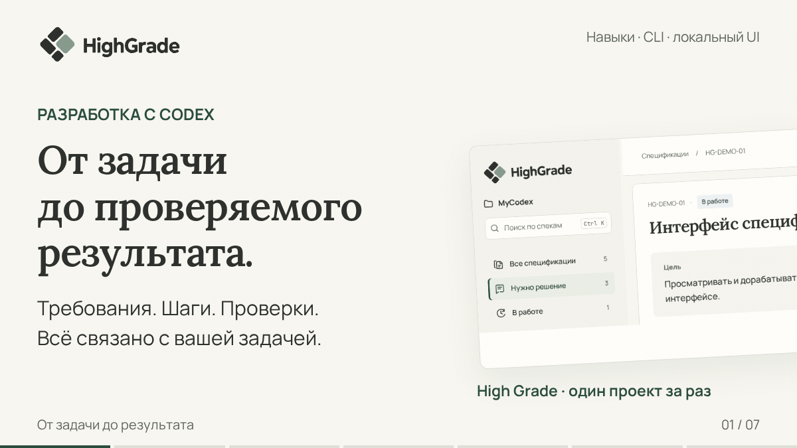

# High Grade

**Доведите задачу с Codex до проверяемого результата.**

Сохраняйте договорённости в проекте, ведите сложную работу по шагам и проверяйте, что получилось.

[](#быстрый-старт)

[Быстрый старт](#быстрый-старт) · [Как это работает](#как-это-работает) · [Документация](docs/README.md) · [MIT](LICENSE)

Навыки Codex, Rust CLI и локальный UI. В GIF — демо и схемы.

## Что это даёт

- **Контекст под рукой.** Цель, требования и решения остаются в проекте.
- **Работа по шагам.** Planner сохраняет порядок задач и точку продолжения.
- **Проверяемый результат.** Сценарии и отчёты показывают готовность и пробелы.

## Быстрый старт

Для сборки: [Codex](https://openai.com/codex/), Git, [Rust/Cargo](https://rustup.rs/), Node.js 24/npm. Rust указан в `rust-toolchain.toml`.

### 1. Установите High Grade

**Linux · Bash**

```bash
git clone https://github.com/Lainterus1/HighGrade.git
cd HighGrade
(cd ui && npm ci && npm run build)
cargo build --release --locked
./target/release/highgrade global-install --profile "$HOME" --source "$PWD/kit" --candidate-exe "$PWD/target/release/highgrade"
./target/release/highgrade global-status --profile "$HOME"
```

**Windows · PowerShell**

```powershell
git clone https://github.com/Lainterus1/HighGrade.git
cd HighGrade
Push-Location ui
npm ci
npm run build
Pop-Location
cargo build --release --locked
.\target\release\highgrade.exe global-install `
  --profile "$env:USERPROFILE" `
  --source (Join-Path $PWD 'kit') `
  --candidate-exe (Join-Path $PWD 'target\release\highgrade.exe')
.\target\release\highgrade.exe global-status --profile "$env:USERPROFILE"
```

Навыки — в `~/.agents/skills`. Если Codex их не обнаружил, перезапустите его.

### 2. Подключите свой проект

Откройте проект в Codex и попросите:

> Используй `$highgrade-init`, обследуй этот проект и предложи минимальную адаптацию High Grade.

Init адаптирует правила и готовит спеки; реализация — следующий шаг. OpenSpec не требуется.

### 3. Начните работу

| Что нужно сделать | Навык |
|---|---|
| Уточнить задачу | `highgrade-task` |
| Вести зависимые задачи | `highgrade-planner` |
| Изменить требования | `highgrade-spec` → `highgrade-work` |
| Исправить код по действующим требованиям | `highgrade-work` |
| Обзор проекта | `highgrade-clear` |
| Локальный коммит | `highgrade-commit` |
| Отправка коммитов | `highgrade-push` |
| Обновление установки | `highgrade-update` |

> Используй `$highgrade-task`. Хочу поиск по заказам.

Коммит, активация, публикация и приёмка — отдельные действия.

## Как это работает

**Задача → требования и сценарии → работа → проверки → результат.**

| Подход | Как он применяется |
|---|---|
| **SDD — от спецификации** | Спека до изменения требований: цель, границы, условия готовности. Формат — JSON. |
| **BDD — через поведение** | Условия → действие → ожидаемый результат (`given / when / then`), связанный с проверкой. |
| **Test-first / TDD** | Проверка → исправление → повтор → улучшение структуры. Для устойчивого автоматического поведения; исключения — по риску. |

Багфикс — в Work по действующим требованиям. Сценарий → проверка → отчёт. Ревью и решение человека — отдельно.

## Спецификации в браузере

Читайте и редактируйте спеки, сохраняйте решения. Init создаёт `HighGrade UI.sh` и `HighGrade UI.cmd` для запуска из проекта.

Установленный UI: браузер без Node.js, Cargo и внешней сети.

**Rust** — CLI/API; **React/TypeScript** — UI; **Playwright/Nextest** — тесты; **Storybook** — демо.

[Интерфейс](docs/UI.md) · [Спецификации](specs/README.md) · [Команды CLI](kit/references/cli.md) · [Проверки исходников](https://github.com/Lainterus1/HighGrade/actions/workflows/verify.yml)

## Цель проекта

Сделать разработку с агентами надёжной, эффективной и удобной. Помочь агенту правильно понять намерение пользователя, самостоятельно выполнить согласованную работу и получить проверяемый результат. Сократить затраты на уточнения, координацию и исправление ошибок.

## Принципы принятия решений

- **Соответствие цели.** Выбирать решения, которые приближают нужный пользователю результат.
- **Обоснованная простота.** Добавлять сложность, только когда её польза превышает затраты.
- **Соразмерность.** Выбирать глубину проработки, формализации и проверок с учётом неопределённости и последствий ошибки.
- **Согласованность.** Поддерживать понятную связь между требованиями, действиями и документами. Убирать противоречия и лишние повторы.
- **Самостоятельность.** Использовать доступный контекст и действовать в пределах полномочий. Запрашивать существенные недостающие решения.
- **Адаптивность.** Учитывать особенности проекта и сохранять полезные существующие решения.
- **Доказательность.** Подтверждать выводы наблюдаемыми результатами. Явно обозначать предположения и неизвестное.
- **Повторное использование.** Давать готовые инструменты и процедуры для повторяющихся задач, чтобы агент мог сосредоточиться на самой работе.

## Критерий улучшения

Изменение полезно, если повышает надёжность, сокращает путь до результата или снижает усилия участников без несоразмерного ухудшения остальных качеств.

## Термины и границы

**Поставка** — устанавливаемые навыки, процедуры, шаблоны и Rust CLI. **Проект** — этот репозиторий. **Подключаемый проект** — проект, адаптируемый High Grade.

Поставка работает без доступа к этому репозиторию. SVG Vectorizer и Code Health Audit — отдельные плагины.

## Для разработчиков Поставки

[Правила](AGENTS.md) · [Устройство](docs/ARCHITECTURE.md) · [Соглашения](docs/ENGINEERING.md) · [Команды и проверки](docs/DEVELOPMENT.md) · [Карта документов](docs/README.md)

[Сборка GIF](ui/scripts/render-readme-demo.mjs) · [Сцены](ui/scripts/readme-demo.html)

Лицензии: [MIT](LICENSE), [импортированные компоненты](NOTICE.md).
